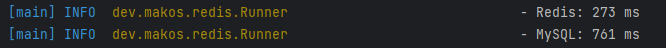

# Project-redis 

Familiarity with caching technology and in-memory database Redis

## GOAL
Compare the speed of getting the same data from MySQL and Redis.

##  Prerequisites
1. Create docker container with MySQL database
```
docker run --name mysql -d -p 3306:3306 -e MYSQL_ROOT_PASSWORD=root --restart unless-stopped -v mysql:/var/lib/mysql mysql:8 
```
* user: **root** 
* password: **root**
2. Expand dump file to MySQL database from resources folder

3. Create docker container with Redis database
```
docker run -d --name redis -p 6379:6379 redis:latest 
```
**optionally** if you have installed redis-insight _(redis client to connect to database)_ you can create instead of the previous container:
```
docker run -d --name redis-stack -p 6379:6379 -p 8001:8001 redis/redis-stack:latest 
```
## To run the project
1. Clone the project;
2. Run the project from Runner.class in your IDE from the main method;

You can manipulate with number of Queries in Runner.class 
```java
public static final int NUMBER_OF_QUERIES = 400;
```
to see the difference in speed of getting data from MySQL and Redis.

